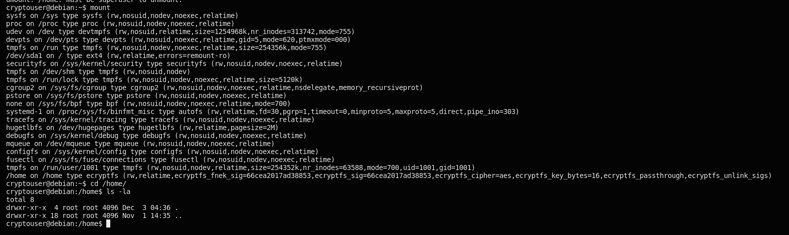
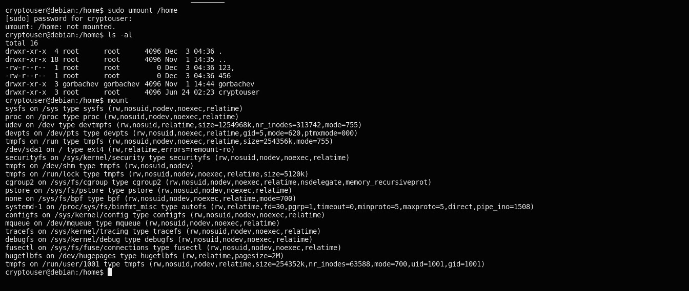
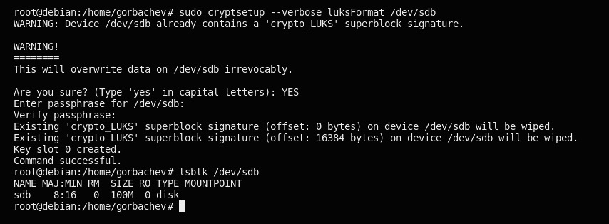

# Домашнее задание к занятию 13.2 "Защита хоста" - `Горбачев Олег`

### Задание 1
* Установите eCryptfs.

* Добавьте пользователя cryptouser.

* Зашифруйте домашний каталог пользователя с помощью eCryptfs.

В качестве ответа пришлите снимки экрана домашнего каталога пользователя с исходными и зашифрованными данными.

### Ответ 1

Доомашний католог, создадим пользователя `cryptouser`.

Шифруем домашний каталог `/home` и пользователя `cryptouser` с помощью `eCryptfs`.

Шифрованный раздел `/home`

Возвращяем доступ к файлам папки `/home` 

Доступ появился в домашней папке `/home`

### Задание 2.
* Установите поддержку LUKS.

* Создайте небольшой раздел (например, 100 Мб).

* Зашифруйте созданный раздел с помощью LUKS.

В качестве ответа пришлите снимки экрана с поэтапным выполнением задания.

___
### Ответ 2

Зашифруем созданный раздел `sbd = 100 Мб` с помощью `LUKS`.

проверяем 

Чтобы расшифровать диск, который был зашифрован с помощью `LUKS`. Требуется выполнить и смонтировать диск 

точка монтирования для подключенного диска.  `/media/mydrive` 

проверяем

После подключения мы сможем получить доступ к подключенному диску из графического файлового менеджера или из командной строки.
